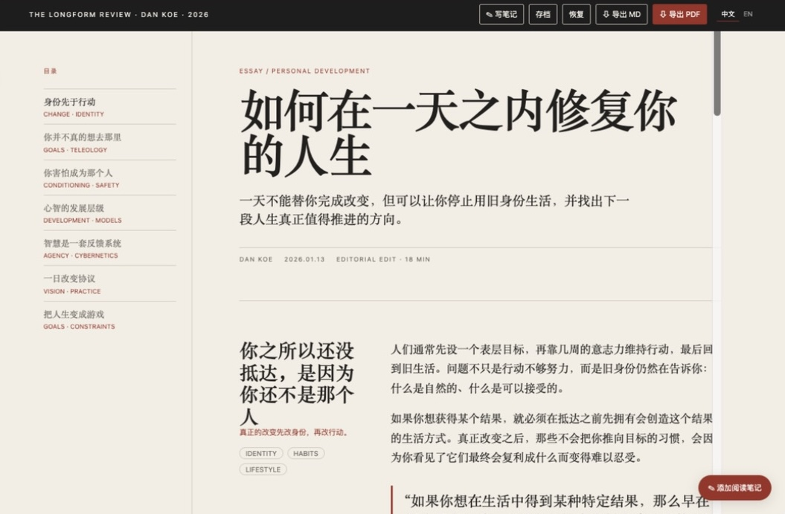
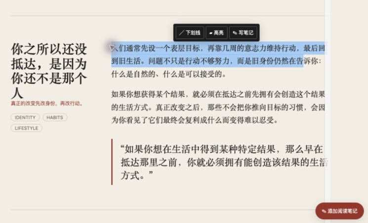

# 轻阅杂志

把播客文字稿、访谈稿或长文整理成适合电脑和手机阅读的双语杂志式网页，并支持章节跳转、划线、高亮、感想笔记、阅读进度保存，以及 PDF / Markdown 导出。

> 轻阅杂志从文字稿开始，不负责把音频转成文字。

## 页面预览

下面的截图来自实际生成的杂志网页，展示了从阅读、标注到导出的完整体验。

### 双栏杂志式阅读

左侧目录与右侧正文各自独立滚动，适合在电脑和手机上进行中英文对照阅读。



### 选中文字进行划线、高亮或写笔记

选中正文后会出现快捷工具栏；划线颜色使用醒目的红色，高亮和笔记也可以随时追加或取消。



### 阅读记录与 PDF / Markdown 导出

标注摘录和感悟笔记会集中显示在文章末尾，并可通过顶部按钮导出为 PDF 或 Obsidian 友好的 Markdown。


## 适合什么场景

- 输入 Markdown、PDF、Word 或 TXT 文字稿
- 中文稿直接排版；英文稿或中英混合稿整理为中英文对照
- 左侧独立滚动的章节目录，右侧独立滚动的正文
- 电脑端和手机端都可以选中文字进行划线、高亮和写感想
- 标注和笔记可导出为包含中英文正文的 PDF 或 Obsidian 友好的 Markdown
- 阅读过程中可保存 JSON 进度，之后恢复标注、笔记和语言状态

## 使用方式

安装后，在 Agent 中说：

```text
请使用 $qingyue-magazine，把我提供的文字稿制作成双语、可标注、可导出 PDF/MD 的杂志式 HTML 阅读页。
```

Skill 会先询问并检查文字稿，再生成 HTML 文件。打开网页后：

1. 点击左侧章节标题跳转。
2. 选中文字，使用划线、高亮或感想按钮；再次点击同一种标记即可取消。
3. 用“中 / 英 / 对照”切换阅读语言。
4. 用“存档”下载阅读进度 JSON，用“恢复”导入之前的 JSON。
5. 读完后及时导出 PDF 或 MD。浏览器清理缓存可能会清除尚未导出的本地记录。

### iPhone / iPad 使用说明

iPhone 和 iPad 的 iOS/iPadOS 版本请统一使用 **Microsoft Edge** 打开、标注和导出。通过“文件”应用选择 HTML 后，使用“分享 → 用 Edge 打开”（如果系统没有显示 Edge，可以先在 Edge 中打开文件或使用 `http(s)://` 网页地址）。

Edge 移动端已经针对触摸选区做兼容处理：选中文字后等待系统选区菜单稳定，再点击页面底部的“下划线 / 高亮 / 写笔记”。Safari 和 Chrome 的 iOS 本地 HTML 打开与选区行为不作为本 Skill 的支持路径。

在 `file://` 场景下，部分 iOS 浏览器可能限制本地缓存，因此跨设备或清理浏览器数据前，请先点击“存档”下载 JSON，读完再导出 PDF / MD。

## 安装

本仓库发布于 `zdmailab/qingyue-magazine`。

### Codex

项目级安装：把仓库中的 `qingyue-magazine/` 复制到项目的 `.codex/skills/qingyue-magazine/`；用户级安装：复制到 `~/.codex/skills/qingyue-magazine/`。确认目录中存在 `SKILL.md` 和 `agents/openai.yaml`，然后重新打开 Codex 或重新加载 Skills。

一键安装 Prompt：

```text
请从 https://github.com/zdmailab/qingyue-magazine 下载仓库，把其中的 qingyue-magazine/ 完整安装到 ~/.codex/skills/qingyue-magazine/。检查 SKILL.md 的 frontmatter 和 agents/openai.yaml；安装完成后告诉我如何用 $qingyue-magazine 测试。
```

### WorkBuddy

在 WorkBuddy 的 Skill 管理入口选择“从 GitHub / 本地目录安装”，指向本仓库中的 `qingyue-magazine/` 目录。若使用文件目录安装，确保 `SKILL.md` 位于安装目录根部，并重载 Skill 列表。

一键安装 Prompt：

```text
请从 https://github.com/zdmailab/qingyue-magazine 安装 qingyue-magazine Skill。安装内容是仓库里的 qingyue-magazine/ 目录；安装后重载 Skill 列表，并用一份 Markdown 文字稿做一次“文字稿转杂志网页”的冒烟测试。
```

### Claude Code

项目级安装到 `.claude/skills/qingyue-magazine/`，或用户级安装到 `~/.claude/skills/qingyue-magazine/`。目录中保留 `SKILL.md`、`agents/` 和 `assets/`，随后重新启动 Claude Code 或刷新 Skills。

一键安装 Prompt：

```text
请从 https://github.com/zdmailab/qingyue-magazine 获取 qingyue-magazine/，安装到当前项目的 .claude/skills/qingyue-magazine/（如果当前目录没有项目 Skill 目录，则安装到 ~/.claude/skills/qingyue-magazine/）。确认 SKILL.md 可读，并说明如何调用它生成双语标注阅读网页。
```

### OpenClaw

把仓库里的 `qingyue-magazine/` 复制到 OpenClaw 当前 workspace 的 `skills/qingyue-magazine/`。如果你的 OpenClaw 配置使用全局 Skills 目录，则放入对应的 `~/.openclaw/skills/qingyue-magazine/`，然后重载或重启 Skill 索引。

一键安装 Prompt：

```text
请从 https://github.com/zdmailab/qingyue-magazine 安装 qingyue-magazine Skill：将仓库里的 qingyue-magazine/ 完整复制到当前 OpenClaw workspace 的 skills/qingyue-magazine/；如当前配置使用全局目录，则改用 ~/.openclaw/skills/qingyue-magazine/。安装后重载 Skill 索引，并用一句“把这篇文字稿转成双语杂志网页”验证触发。
```

## 手动安装

```bash
git clone https://github.com/zdmailab/qingyue-magazine.git
cp -R qingyue-magazine/qingyue-magazine ~/.codex/skills/qingyue-magazine
```

其他 Agent 只需把最后的目标目录换成对应平台的 Skills 目录即可。

## 文件结构

```text
qingyue-magazine/
├── SKILL.md
├── agents/openai.yaml
├── assets/magazine-template.html
└── assets/screenshots/
    ├── 01-reader-layout.jpg
    ├── 02-annotation-toolbar.jpg
    └── 03-reading-record-export.jpg
```

## 注意事项

这是一个本地 HTML 阅读工具，标注和笔记默认保存在浏览器的 localStorage 中。清理浏览器缓存、隐私模式关闭页面或更换浏览器，都可能让未导出的内容消失；建议阶段性点击“存档”，读完后及时导出 PDF 或 MD。
